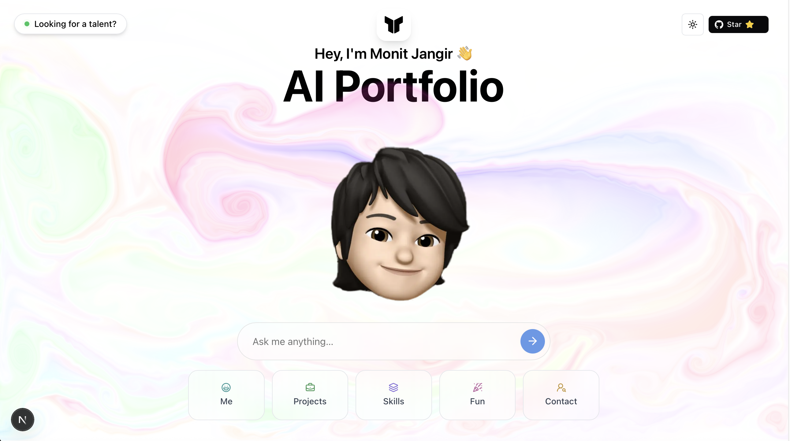

<div align="center">
  
  <h1>Monit Jangir's AI-Native Portfolio</h1>
  <p>
    <strong>Step into the future of personal portfolios. Ask me anything.</strong>
  </p>
  <br/>
  
  <p>
    <a href="https://nextjs.org/"></a>
    <a href="https://tailwindcss.com/"></a>
    <a href="https://mistral.ai/"></a>
    <a href="https://vercel.com/"></a>
  </p>
  
  <p>
    
    
    
    
  </p>
</div>

---

### 💬 Why have a static portfolio when you can have a conversation?

Traditional portfolios are one-sided and lifeless. This project reimagines the personal portfolio as an **AI-powered, interactive experience**. Instead of forcing recruiters and peers to just scroll, it invites them to ask questions and get answers tailored to their interests.

It’s a portfolio that doesn't just show—it communicates.

<br>

<div align="center">
  <a href="https://www.your-live-demo-link.com"> <!-- 👈 UPDATE THIS LINK! -->
    
  </a>
</div>

<br>

### ✨ Key Features

*   **🤖 Dynamic AI Conversation:** Powered by Mistral, the portfolio provides instant, context-aware answers about my skills, projects, hobbies, and more.
*   **💡 Intelligent Tool Usage:** The AI can render dynamic React components to showcase projects, skills, and even my resume in a rich, interactive format.
*   **🎨 Modern & Responsive UI:** Built with Next.js and styled with Tailwind CSS, featuring smooth animations from Framer Motion for a polished user experience.
*   **🚀 Optimized for Performance:** Fast, responsive, and deployed globally on Vercel for a seamless experience for every visitor.

---

### 🛠️ Tech Stack & Tools

This project is built with a modern, AI-focused technology stack.

| Category          | Technologies                                                                                                                                                                                                                                                         |
| ----------------- | -------------------------------------------------------------------------------------------------------------------------------------------------------------------------------------------------------------------------------------------------------------------- |
| **Frontend**      |    |
| **Styling**       |              |
| **AI & Backend**  |    |
| **Deployment**    |                                                                                                                                                               |
| **Package Manager**|                                                                                                                                                                    |

---

### 🚀 Getting Started: Running Locally

Want to get this project running on your own machine? Just follow these steps.

#### Prerequisites
*   Node.js (v18 or higher)
*   pnpm (`npm install -g pnpm`)
*   A Mistral AI API Key

#### Local Setup

1.  **Clone the repository:**
    ```sh
    git clone https://github.com/monit-jangir/monit-s-portfolio.git
    cd monit-s-portfolio
    ```

2.  **Install dependencies using pnpm:**
    ```sh
    pnpm install
    ```

3.  **Set up your environment variables:**
    Create a `.env.local` file in the root of your project and add your Mistral API key:
    ```env
    MISTRAL_API_KEY="your_mistral_api_key_here"
    ```

4.  **Run the development server:**
    ```sh
    pnpm run dev
    ```

5.  Open your browser and navigate to `http://localhost:3000`.

---

### 🤝 Contributing

Contributions make the open-source community an incredible place to learn, create, and inspire. Any contributions you make are **greatly appreciated**.

Please feel free to fork the repo, create a feature branch, and open a pull request. You can also open an issue with the "bug" or "enhancement" tag.

---

### 📄 License

This project is open-sourced under the **MIT License**. See the `LICENSE` file for more information.

---

### 🔗 Connect with Me

Let's connect! I'm always open to discussing new projects, creative ideas, or opportunities in the world of AI and tech.

<div align="center">

[](https://www.linkedin.com/in/monitkjangir/)
&nbsp;
[](https://github.com/monit-jangir)
&nbsp;
[](mailto:monit.j@outlook.com)

</div>```

### Key Improvements in This Redesign:

*   **Stronger Title & Tagline:** Clear, personal, and immediately explains the project's purpose.
*   **Organized Badges:** Grouped badges for better readability (Tech, Repo Stats).
*   **Clear Call-to-Action:** A prominent "View Live Demo" button right at the top.
*   **Benefit-Oriented Features:** The "Features" list is rewritten to explain *why* each feature is cool.
*   **Visual Tech Stack:** The tech stack table is replaced with a more modern, visually appealing list using badges with icons.
*   **Updated Links:** All GitHub repository links have been updated to your `monit-jangir` username.
*   **Professional "Connect with Me" Section:** A dedicated, clean section for your social/contact links.
*   **Improved Structure & Flow:** The entire document is re-ordered to be more logical and scannable for any visitor.